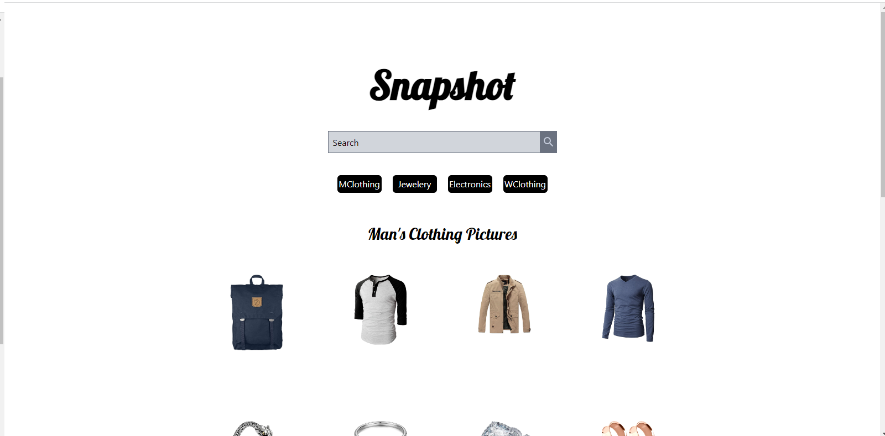

# Website Application

This project contains a website application built using HTML, Tailwind CSS, and JavaScript.

## Snapshot

## Project Description

This project encompasses a website application developed with HTML, CSS, and JavaScript. The user interface is designed using Tailwind CSS. The project is responsive and adapts to different screen sizes.Also this project is contain API and different JS technuqies.

## Installation

1. Clone the repository: `git clone https://github.com/username/project.git`
2. Navigate to the project directory: `cd project`
3. Open the `index.html` file in a web browser.

## Usage

When the website application is opened in a web browser, it may contain specific pages or sets of features. Users can explore different features such as menus, forms, image galleries, or interact with interactive components.

## Resources

- [Tailwind CSS](https://tailwindcss.com/) - Modern CSS framework

